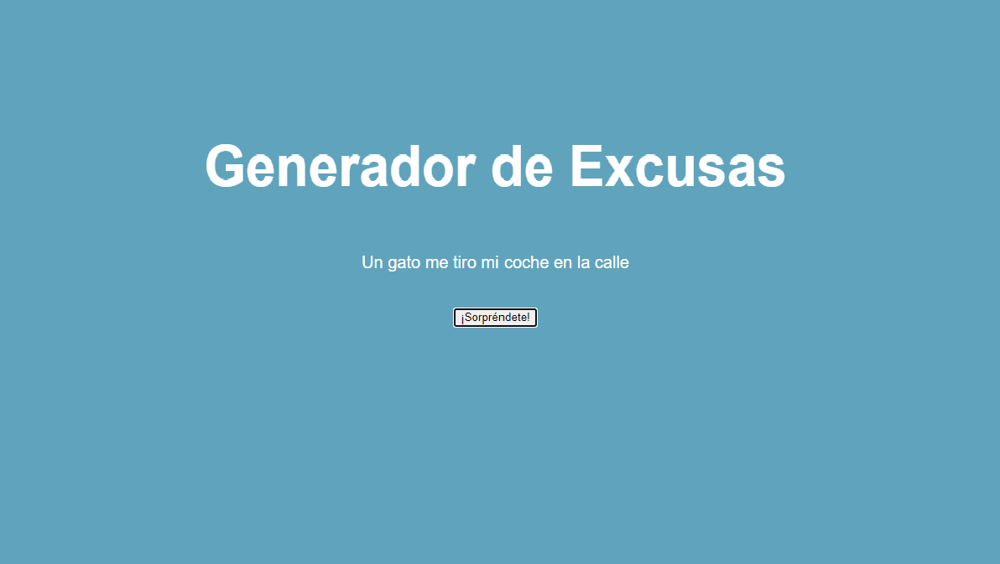

# Generador de Excusas en Javascript



### Instalación Manual:

1) Recuerda instalar primero los paquetes de npm:
```
$ npm install
```

2) ¡Construye y empieza a codificar!

Construye la aplicación por primera vez...

```
$ npm run start
```


## Instrucciones


 1) Crea un sitio web pequeño que genere una excusa cada vez que se presione un botón

 2) Crea un index.html con una excusa codificada, no js, solo una excusa en HTML puro y simple.

3) La excusa debe estar dentro de una etiqueta HTML que tenga un ID asignado.

4) Usando javascript, crea una función que genere y devuelva una excusa    aleatoria
5) Para crear una excusa consistente, tiene que concatenar un elemento de cada array o arreglo en el orden correcto.
6) Llame a esa función onLoad y establezca la excusa en el innerHTML del elemento HTML #excuse.
Tecnologías
HTML, CSS3, Sass, Javascript, Webpack.

## Fundamentos
Este ejercicio cubre los siguientes fundamentos: 
- Utilizar archivos Javascript externos en tu proyecto. 
- Cómo trabajar con arreglos. 
- Generar números al azar. 
- Concatenar strings (cadenas). 
- Utilizar funciones (al menos un poco). 
- Trabajar con eventos (al menos un poco)
